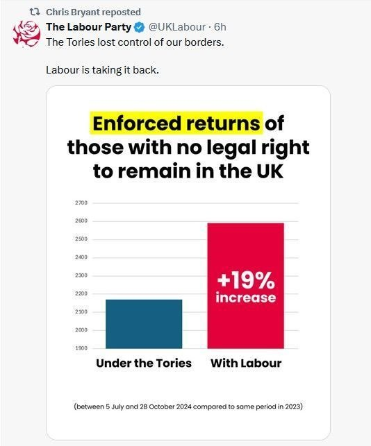

# Bad Examples

As part of the session, learners are given a selection of visualisations and asked to discuss with each other what makes them bad or misleading. Some of these were submitted by undergraduate students on the Introduction to Data Science course at the University of Edinburgh.

