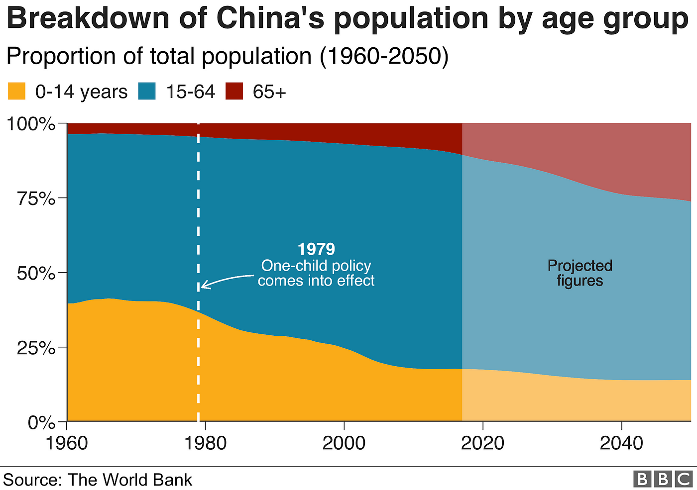
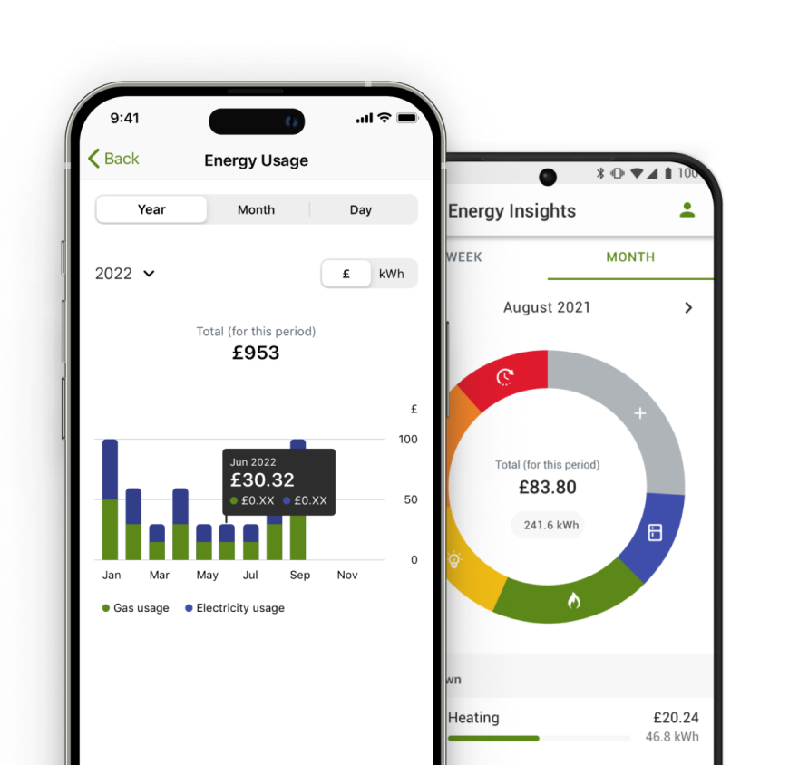

```{r setup, include=FALSE}
options(htmltools.dir.version = FALSE)
library(tidyverse)
library(kableExtra)
```

# The Data Age

Data is **everywhere**. It's part of our news and our politics.

|||
|:-:|:-:|
|BBC Visual and Data Journalism (2019)|Conservative Party Leaflet (2024)|

---

# The Data Age

Data is **everywhere**. It's part of important everyday information.

|||
|:-:|:-:|
|Scottish Power Dashboard|Monzo Bank Statements|

---

# Outline

<br>

### 1. Common visualisation types
### 2. More complex visualisations
### 3. Spotting misleading features

---
class: inverse, middle, center

# 1. Common Visualisations

---

# Data Tables

Data from the 1974 _Motor Trend_ magazine, covering design and performance for 32 cars.

```{r example-table, echo=FALSE}
knitr::kable(tail(mtcars), format = 'html')
```

```txt
mpg:  Miles (US) gallon            qsec: 1/4 mile time
cyl:  Number of cylinders          vs:   Engine (0 = V-shaped, 1 = straight)
disp: Displacement (cu.in.)        am:   Transmission (0 = automatic, 1 = manual)
hp:   Gross horsepower             gear: Number of forward gears
wt:   Weight (1000 lbs)
```

---

# Continuous Data

Looking just at `mpg`, which is a number for fuel consumption in miles per gallon.

```{r mpg-table, echo=FALSE}
knitr::kable(head(mtcars[,1, drop=FALSE], 8), format = 'html')
```

---

# Bar Charts

Each bar is the height of the `mpg` data.

```{r bar-chart, echo=FALSE, fig.height=6, fig.width=10, dev='svg'}
ggplot(mtcars) +
  geom_bar(stat="identity", aes(x=row.names(mtcars), y=mpg, fill=mpg)) +
  theme_minimal() +
  labs(
    title = "Barplot of MPG by Car Model",
    x = "",
    y = "miles per gallon",
    fill = "Legend"
  ) +
  # flip x axis labels to keep them all nice and readable
  theme(axis.text.x = element_text(angle = 90, vjust = 0.5, hjust=1))
```

---

# Category Data

Looking just at `cyl`, which is a number of cylinders.

```{r cyl-table, echo=FALSE}
knitr::kable(
  list(
    mtcars[ 1: 8,2, drop=FALSE],
    mtcars[ 9:16,2, drop=FALSE],
    mtcars[17:24,2, drop=FALSE],
    mtcars[25:32,2, drop=FALSE]
  ),
  format = 'html'
) %>% kable_styling(font_size = 7)
```

This is a 'frequency table' of that data.

```{r cyl-table-freq, echo=FALSE}
cyl_freq <- table(mtcars[,2], dnn=c("Cylinders"))

knitr::kable(cyl_freq, format = 'html') %>%
  kable_styling(font_size = 12)
```

---

# Pie Charts

Each slice is the proportion of cars that had that many cylinders. 

```{r pie-chart, echo=FALSE, fig.height=6, fig.width=10, dev='svg'}
ggplot(data.frame(cyl_freq), aes(x = "", y = Freq, fill = Cylinders)) +
  geom_col() +
  geom_text(
    aes(label = paste(Freq, " (", round(100*Freq/length(mtcars$cyl)), "%)", sep="")),
    position = position_stack(vjust=0.5)  
  ) +
  coord_polar(theta = "y") +
  labs(title = "Pie Chart of Cylinder Counts") +
  theme_void() +
  scale_fill_brewer()
```

---

# Doughnut Charts

Each slice is the proportion of cars that had that many cylinders. 

```{r doughtnut-chart, echo=FALSE, fig.height=6, fig.width=10, dev='svg'}
hole_size <- 2
cyl_freq <- data.frame(cyl_freq) %>% mutate(x = hole_size)

ggplot(data.frame(cyl_freq), aes(x = hole_size, y = Freq, fill = Cylinders)) +
  geom_col() +
  geom_text(
    aes(label = paste(Freq, " (", round(100*Freq/length(mtcars$cyl)), "%)", sep="")),
    position = position_stack(vjust=0.5)  
  ) +
  coord_polar(theta = "y") +
  xlim(c(0, hole_size + 0.5)) +
  labs(title = "Doughtnut Chart of Cylinder Counts") +
  theme_void() +
  scale_fill_brewer()
```

---


class: inverse, middle, center

# 2. More Complex Visualisations

---

# Dummy


---
class: inverse, middle, center

# 3. Spotting Misleading Features

---

# Dummy
