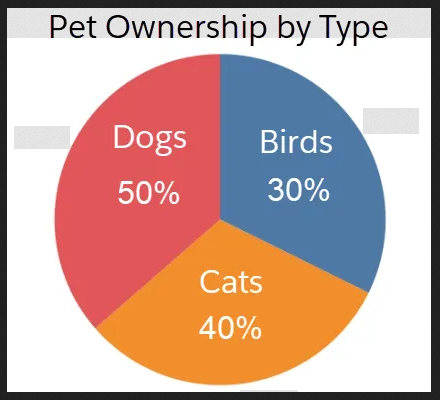

```{r setup, include=FALSE}
options(htmltools.dir.version = FALSE)
library(tidyverse)
library(kableExtra)
```

# The Data Age

Data is **everywhere**. It's part of our news and our politics.

|||
|:-:|:-:|
|BBC Visual and Data Journalism (2019)|Conservative Party Leaflet (2024)|

---

# The Data Age

Data is **everywhere**. It's part of important everyday information.

|||
|:-:|:-:|
|Scottish Power Dashboard|Monzo Bank Statements|

---

# Outline

<br>

### 1. Common visualisation types
### 2. More complex visualisations
### 3. Spotting misleading features

---
class: inverse, middle, center

# 1. Common Visualisations

---

# Data Tables

Data from the 1974 _Motor Trend_ magazine, covering design and performance for 32 cars.

```{r example-table, echo=FALSE}
knitr::kable(tail(mtcars), format = 'html')
```

```txt
mpg:  Miles (US) gallon            qsec: 1/4 mile time
cyl:  Number of cylinders          vs:   Engine (0 = V-shaped, 1 = straight)
disp: Displacement (cu.in.)        am:   Transmission (0 = automatic, 1 = manual)
hp:   Gross horsepower             gear: Number of forward gears
wt:   Weight (1000 lbs)
```

---

# Continuous Data

Looking just at `mpg`, which is a number for fuel consumption in miles per gallon.

```{r mpg-table, echo=FALSE}
knitr::kable(head(mtcars[,1, drop=FALSE], 8), format = 'html')
```

---

# Bar Charts

Each bar is the height of the `mpg` data.

```{r bar-chart, echo=FALSE, fig.height=6, fig.width=10, dev='svg'}
ggplot(mtcars) +
  geom_bar(stat="identity", aes(x=row.names(mtcars), y=mpg, fill=mpg)) +
  theme_minimal() +
  labs(
    title = "Barplot of MPG by Car Model",
    x = "",
    y = "miles per gallon",
    fill = "Legend"
  ) +
  # flip x axis labels to keep them all nice and readable
  theme(axis.text.x = element_text(angle = 90, vjust = 0.5, hjust=1))
```

---

# Category Data

Looking just at `cyl`, which is a number of cylinders.

```{r cyl-table, echo=FALSE}
knitr::kable(
  list(
    mtcars[ 1: 8,2, drop=FALSE],
    mtcars[ 9:16,2, drop=FALSE],
    mtcars[17:24,2, drop=FALSE],
    mtcars[25:32,2, drop=FALSE]
  ),
  format = 'html'
) %>% kable_styling(font_size = 7)
```

This is a 'frequency table' of that data.

```{r cyl-table-freq, echo=FALSE}
cyl_freq <- table(mtcars[,2], dnn=c("Cylinders"))

knitr::kable(cyl_freq, format = 'html') %>%
  kable_styling(font_size = 12)
```

---

# Pie Charts

Each slice is the proportion of cars that had that many cylinders. 

```{r pie-chart, echo=FALSE, fig.height=6, fig.width=10, dev='svg'}
ggplot(data.frame(cyl_freq), aes(x = "", y = Freq, fill = Cylinders)) +
  geom_col() +
  geom_text(
    aes(label = paste(Freq, " (", round(100*Freq/length(mtcars$cyl)), "%)", sep="")),
    position = position_stack(vjust=0.5)  
  ) +
  coord_polar(theta = "y") +
  labs(title = "Pie Chart of Cylinder Counts") +
  theme_void() +
  scale_fill_brewer()
```

---

# Doughnut Charts

Each slice is the proportion of cars that had that many cylinders. 

```{r doughtnut-chart, echo=FALSE, fig.height=6, fig.width=10, dev='svg'}
hole_size <- 2
cyl_freq <- data.frame(cyl_freq) %>% mutate(x = hole_size)

ggplot(data.frame(cyl_freq), aes(x = hole_size, y = Freq, fill = Cylinders)) +
  geom_col() +
  geom_text(
    aes(label = paste(Freq, " (", round(100*Freq/length(mtcars$cyl)), "%)", sep="")),
    position = position_stack(vjust=0.5)  
  ) +
  coord_polar(theta = "y") +
  xlim(c(0, hole_size + 0.5)) +
  labs(title = "Doughtnut Chart of Cylinder Counts") +
  theme_void() +
  scale_fill_brewer()
```

---

# Beware the Pie Chart

Pie charts are more difficult to compare than bar charts.

```{r bad-pies, out.width=650, out.height=400, echo=FALSE}

```

---

# Comparing Continuous Data

Looking at fuel consumption `mpg` and horsepower `hp`.

```{r mpg-hp-table, echo=FALSE}
knitr::kable(head(mtcars[,c(1,4,2), drop=FALSE], 8), format = 'html')
```


---

# Scatter Plot

Two continuous variables can be plotted on a grid, using values to determine location.

```{r scatter-plot, echo=FALSE, fig.height=5.5, fig.width=9.06, dev='svg'}
# plot features that will be common for both
scatter_example <- ggplot(mtcars, aes(x = hp, y = mpg)) +
  theme_minimal() +
  labs(
    title = "Scatter Plot of MPG against Horsepower",
    x = "horsepower",
    y = "miles per gallon",
  ) +
  ylim(0,35)

# for first example, all point the same
scatter_example + geom_point(size = 4, alpha=0.33, color="blue")
```

---

# Scatter-Factor Plot

We can also use other features like colour and point shape to display categories.


```{r scatter-factor-plot, echo=FALSE, fig.height=5.5, fig.width=10, dev='svg'}
# for second example, points coloured by cylinders
scatter_example +
  geom_point(aes(color = factor(cyl)), size = 4, alpha=0.33) +
  labs(color="Cylinders") +
  scale_color_manual(values = c(
    "4" = "red",
    "6" = "orange",
    "8" = "blue")
  )
```

---

# Scatter Trend Plot

We can also identify trend lines between continuous variables.

```{r scatter-trend-plot, echo=FALSE, fig.height=5.5, fig.width=9.06, dev='svg'}
# for second example, points coloured by cylinders
scatter_example +
  geom_point(size = 4, alpha=0.33, color="blue") +
  geom_smooth(formula=y~I(log10(x)), method = "lm")
```

---

# Continuous Frequencies

Frequency tables for continuous variables aren't very useful.

```{r mpg-freq, echo=FALSE}
cyl_freq <- table(mtcars[,1], dnn=c("mpg"))

knitr::kable(t(head(cyl_freq,20)), format = 'html') %>%
  kable_styling(font_size = 14)
```

Instead, we collect the different values into 'bins'.

```{r mpg-bins, echo=FALSE}
mpg_bins <- as.data.frame(table(cut(mtcars$mpg, breaks=seq(5,40, by=5)), dnn="Range"))

knitr::kable(t(mpg_bins), format = 'html')
```

Here `(a,b]` can be read as $$a \lt x \leq b.$$

---

# Histogram

The area of each bar is proportional to the frequency in that 'bin'.

```{r histogram-example, echo=FALSE, fig.height=5.5, fig.width=10, dev='svg'}
ggplot(mtcars, aes(x = mpg)) +
  theme_minimal() +
  labs(
    title = "Histogram of Fuel Efficiency",
    x = "miles per gallon",
    y = "frequency",
  ) +
  geom_histogram(binwidth = 5, boundary = 0, fill = "#041E42", colour = "white") +
  xlim(10, 35) +
  ylim(0, 13)
```


---
class: inverse, middle, center

# 2. More Complex Visualisations

---

# Time Series Data

Monthly totals of deaths or serious injuries while driving in Great Britain, 1969 to 1984.

```{r example-timeseries, echo=FALSE}
dfSeatbelts <- data.frame(
  # convert time series dates to character format
  date = rownames(data.frame(.preformat.ts(Seatbelts), stringsAsFactors = FALSE)),
  # drop the three columns we won't use
  subset(Seatbelts, select = -c(DriversKilled, PetrolPrice, VanKilled))
)

knitr::kable(head(dfSeatbelts), format = 'html')
```

```txt
date:     month and year of recorded data.
drivers:  car drivers killed or seriously injured.
front:    front-seat passengers killed or seriously injured.
rear:     rear-seat passengers killed or seriously injured.
kms:      distance driven
law:      0/1: was wearing seatbelts compulsary?
```

---

# Line Graphs

Height of line is the value being tracked, with the date the compulsary seatbelt law came into effect (31 Jan 1983) highlighted.

```{r linegraph-example, echo=FALSE, fig.height=5.5, fig.width=10, dev='svg'}
linegraph <- ggplot(dfSeatbelts) +
  theme_minimal() +
  labs(
    title = "Serious Car Accidents by Month",
    x = "Date",
    y = "Number",
  ) +
  geom_vline(xintercept=1983, col="orange", alpha=0.4, linewidth=2.5)

linegraph + geom_line(aes(x=as.numeric(time(Seatbelts)), y=drivers), linewidth=1)
```

---

# Multi-Line Graphs

For multiple time series, we can plot each variable as a different line.

```{r multilinegraph-example, echo=FALSE, fig.height=5.5, fig.width=10, dev='svg'}
df <- dfSeatbelts %>%
  pivot_longer(cols=c('drivers', 'front', 'rear'),
               names_to='Passenger',
               values_to='Deaths')

# BUG messed up the dates on this one so had to hack this bit
multi_plot <- ggplot(df, aes(x=1969+time(date)/36.05, y=Deaths)) +
  theme_minimal() +
  labs(
    title = "Serious Car Accidents by Month",
    x = "Date",
    y = "Number",
  ) +
  scale_color_manual(
    name='Passenger Type',
    labels=c('Driver', 'Front Seat', 'Back Seat'),
    values=c('red', 'purple', 'blue')
  ) +
  scale_fill_manual(
    name='Passenger Type',
    labels=c('Driver', 'Front Seat', 'Back Seat'),
    values=c('red', 'purple', 'blue')
  )

multi_plot +
  geom_line(aes(color=Passenger)) +
  geom_vline(xintercept=1983, col="orange", alpha=0.4, linewidth=2.5)
```

---

# Stacked Area Graphs

Alternatively, we can plot them as areas stacked on top of one another.

```{r stackplot-example, echo=FALSE, fig.height=5.5, fig.width=10, dev='svg'}
multi_plot + geom_area(aes(fill=Passenger), position="stack") +
  geom_vline(xintercept=1983, col="gray", linewidth=1)
```

---
class: inverse, middle, center

# Other Visualisation Types

## (the weird ones)

---

# Sankey Diagrams

Used to show how 'units' slow through a system or process.


---

# Sankey Diagrams

More recently, Sankeys have become a popular way to display income and expenditure.

```{r sankey-example, out.width=650, out.height=400, echo=FALSE}

```

---

# Treemaps

An alternative to bar or pie charts for more complicated systems


| United Kingdom Product Exports (2019) | Key |
|:-- | :-- |
|  |  |

---

# (Actual) Maps

| Solar Potential (2021) | Swine Flu Cases (2009) | Constituencies (2019) |
| :--------------------- | :--------------------- | :-------------------- |
||||


---
class: inverse, middle, center

# 3. Spotting Misleading Features


---

# Pie Charts

Two typical examples of how pie charts are misused.

| Example 1 | Example 2 |
| :-------: | :-------: |
|  |  |

---

# Bar Charts

Changing the $y$-axis can have a significant impact on bar charts.


---

# Line Graphs

It can also impact line graphs, especially with multiple variables displayed. 


---

# Exercise

For the examples we have here consider:

### 1. Which are misleading?
### 2. What might be the impact be?
### 3. How could it be fixed?

---
class: inverse, middle, center

# End
