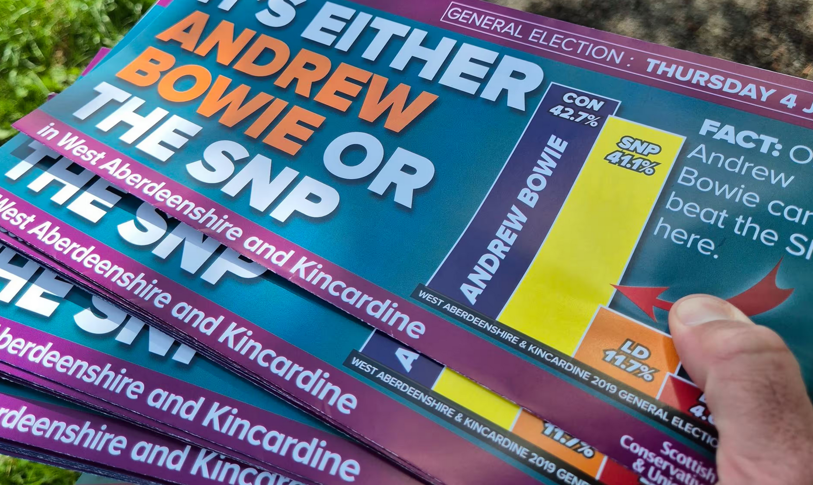

```{r setup, include=FALSE}
options(htmltools.dir.version = FALSE)
library(tidyverse)
```

# The Data Age

Data is **everywhere**. It's part of our news and our politics.

|||
|:-:|:-:|
|BBC Visual and Data Journalism (2019)|Conservative Party Leaflet (2024)|

---

# The Data Age

Data is **everywhere**. It's part of important everyday information.

|||
|:-:|:-:|
|Scottish Power Dashboard|Monzo Bank Statements|

---

# Outline

<br>

### 1. Common visualisation types
### 2. More complex visualisations
### 3. Spotting misleading features

---
class: inverse, middle, center

# 1. Common Visualisations

---
# Data Tables

Data from the 1974 _Motor Trend_ magazine, covering design and performance for 32 cars.

```{r example-table, echo=FALSE}
knitr::kable(tail(mtcars), format = 'html')
```

```{txt labels}
mpg:  Miles (US) gallon             qsec: 1/4 mile time
cyl:  Number of cylinders           vs:   Engine (0 = V-shaped, 1 = straight)
disp: Displacement (cu.in.)         am:   Transmission (0 = automatic, 1 = manual)
hp:   Gross horsepower              gear: Number of forward gears
wt:   Weight (1000 lbs)
```
---
# Bar Charts

```{r bar-chart, echo=FALSE}
ggplot(mtcars, aes(y=mpg)) +
  geom_bar() +
  theme_minimal()
```

---
class: inverse, middle, center

# 2. More Complex Visualisations

---
# Dummy

---
class: inverse, middle, center

# 3. Spotting Misleading Features

---
# Dummy
